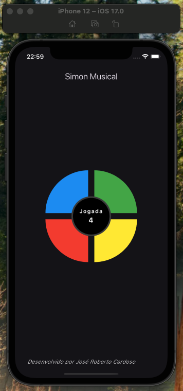
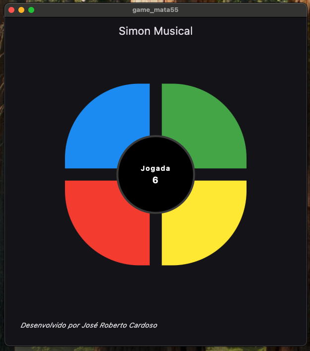
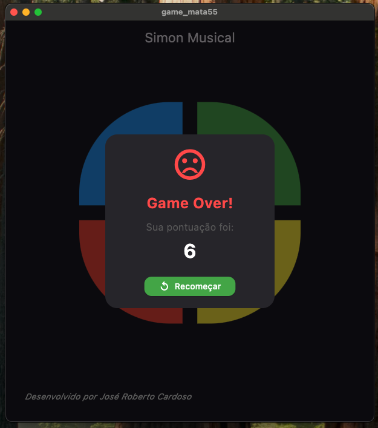
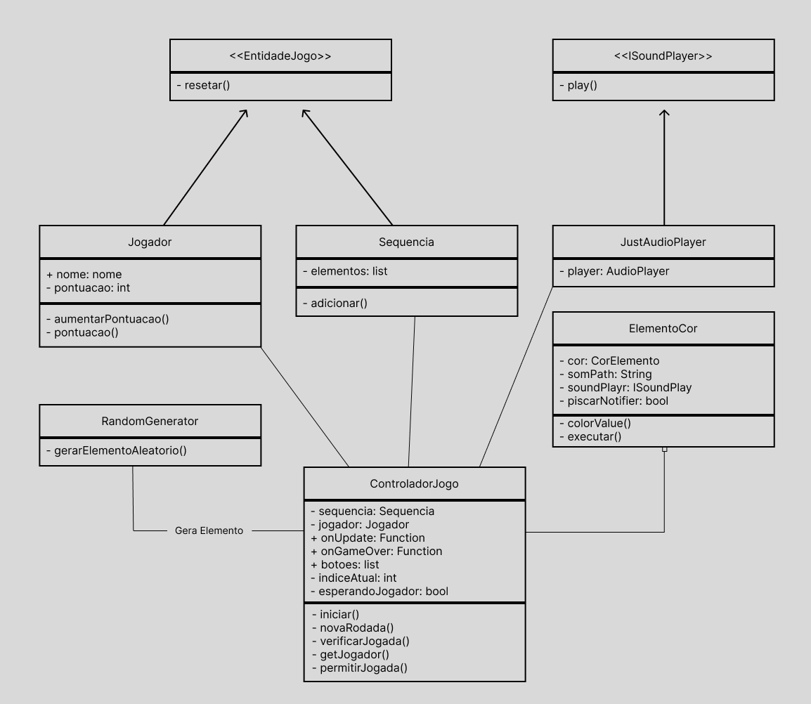

# 🎵 Simon Musical - Jogo Multiplataforma com Flutter

> Um clássico reinventado: teste sua memória auditiva e visual com o Simon Musical!  
> Desenvolvido como trabalho prático para a disciplina de Programação Orientada a Objetos (POO).

---

## 📱💻 Sobre o Projeto

**Simon Musical** é uma recriação do clássico jogo Simon, onde o jogador precisa reproduzir sequências de cores e sons que vão aumentando em dificuldade. O diferencial desta versão é que o jogo é **totalmente multiplataforma**, funcionando perfeitamente em **dispositivos móveis e desktops**.

---

## 🎯 Objetivos

- Aplicar os conceitos de **Programação Orientada a Objetos (POO)** na prática.
- Criar um projeto divertido, interativo e visualmente agradável.
- Desenvolver uma arquitetura extensível, organizada e desacoplada.
- Tornar o jogo multiplataforma com Flutter.

---

## 🧠 Conceitos

| Conceito           | Como foi aplicado                                                                 |
|--------------------|------------------------------------------------------------------------------------|
| **Organização**    | Estrutura em pacotes como `core/`, `widgets/`, `interfaces/`, `entities/`, etc.   |
| **Encapsulamento** | Atributos privados, `ValueNotifier`, uso de métodos de acesso controlados          |
| **Composição**     | `ControladorJogo` possui um `Jogador` e lista de `ElementoCor`                    |
| **Agregação**      | `Jogador` sendo passado ao `ControladorJogo`, mas com ciclo de vida independente  |
| **Interfaces**     | Interface `ISoundPlayer` para desacoplar a lib de áudio (`just_audio`)            |
| **Animações**      | Animação ao piscar dos botões implementada com `AnimatedContainer`                |
| **Multiplataforma**| Compatível com Android, Windows e outros através do Flutter                       |
| **Responsividade** | Botões em forma de "pizza", com espaçamento circular e responsivo                 |

---

## 🧩 Estrutura Visual

| Tela               | Descrição                                   |
|--------------------|---------------------------------------------|
| Jogo Rodando       | Exibição de botões coloridos em círculo     |
| Game Over          | Diálogo estilizado com pontuação final      |
| Interação          | Feedback visual e sonoro imediato           |
| Multiplataforma    | Funciona em celular e desktop               |

---

## 📸 Imagens

> As imagens abaixo estão na pasta `/assets/` do projeto.

### ✅ Jogo rodando no celular:


### 💻 Jogo rodando no desktop:


### ❌ Tela de Game Over (Desktop):


### Diagrama de classes UML


---

## 🛠️ Tecnologias Usadas

- **Flutter**
- **Dart**
- `just_audio` (tocador de áudio)
- `ValueNotifier` + `AnimatedContainer` (para animações e reatividade)
- Suporte a `GestureDetector` para cliques personalizados
- Suporte multiplataforma: Android, Windows, Web (opcional)

---

## 📄 Como Rodar o Projeto

### 🔧 Pré-requisitos

- Flutter SDK instalado
- Dart SDK incluído no Flutter
- Editor como VS Code ou Android Studio
- Emulador, dispositivo físico ou ambiente desktop

### ▶️ Rodando localmente

```bash
git clone https://github.com/JoseCardoso-dev/game-flutter-mata55.git
cd simon-musical
flutter pub get
flutter run
```

---

### 🙋 Autor
Nome: José Roberto Souza Cardoso
Disciplina: Programação Orientada a Objetos (POO)
Professor: Rodrigo Rocha Gomes e Souza
